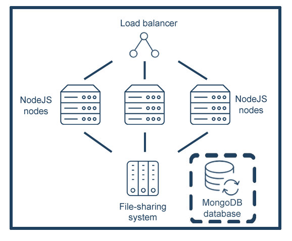

# Sample MEAN application
## Esto es una prueba para realizar con las ramas

HOOOOOLAAAAAA

This application is an example of how to deploy Node.js applications in high availability mode in the Azure cloud.

ystem in just a few minutes. In order to quickly and easily provision a globally distributed and scalable database, consider the **Azure Cosmos DB** service. Check [this link](https://docs.microsoft.com/en-us/azure/cosmos-db/introduction) for the full list of Azure Cosmos DB features. Also, check how to connect your application to a MongoDB CosmosDB database [in this example](#example-for-a-mongodb-cosmos-deploy).

All the configuration related to the application and the database is made by environment variables in the Azure interface and passed to each application node via an [env file](#init-script). To get more information about how the Node.Js High-Availability Cluster template work, please visit the bitnami documentation:

https://docs.bitnami.com/azure-templates/infrastructure/nodejs

# Architecture



# Requirements

For your application to be compatible with the Node.js High-Availability Cluster solution it should fulfill the next requirements:

º## Server port

The Node.js High-Availability Cluster template creates a LoadBalancer on the port 80 that redirects HTTP traffic to an unprivileged port. This port is accessible using the **BACKEND_PORT** environment variable.

In this example the port is configured in the [server.js](https://github.com/bitnami/sample-mean/blob/master/server.js) file:

```javascript
var port = process.env.BACKEND_PORT || process.env.PORT || 3000; 				// set the port
```

## Data folder

The Node.js High-Availability Cluster configures a shared filesystem between the application nodes so all your public assets are synchronized between your application nodes.
You should configure the folder to store static files using the **DATA_FOLDER** environment variable.

In this example this location is configured in the [paths.js](https://github.com/bitnami/sample-mean/blob/master/config/paths.js) file:

```javascript
staticFiles: process.env.DATA_FOLDER + '/public'
```

## Init script

Your application should include a run.sh script like the one included in this repo (or similar).

* The script should load the deployment environment so certain environment variables are available during the initialization:

    ```bash
    # Load deployment environment
    . /root/.deployment.env
    ```

    The following is an example of the content of this file:

    ```bash
    #
    # Deployment environment variables
    #

    export DATA_FOLDER="/bitnami/app"
    export APP_FOLDER="/app"
    export DATABASE_USER="app_user"
    export DATABASE_NAME="app_db"
    export DATABASE_PASSWORD="app_password"
    export DATABASE_HOST="app_host"
    export DATABASE_PORT="app_port"
    export DATABASE_CONNECTION_OPTIONS="app_connection_options"
    export BACKEND_PORT="3000"
    export PATH="/opt/bitnami/nami/bin:/usr/local/sbin:/usr/local/bin:/usr/sbin:/usr/bin:/sbin:/bin:/opt/bitnami/node/bin:/opt/bitnami/python/bin:/opt/bitnami/nami/bin"
    ```

    For security reasons, the permissions of this file are 600 and it is only loaded in the `run.sh` script so this environment variables are not available for users logged in the machine.


* It must include a `start()` hook with instructions to start the application. In this example we are using [pm2](http://pm2.keymetrics.io/) to start the application as it handles the monitoring and process management for us.

  If you want to use `npm` directly you should take care of these tasks manually. For example:

  ```bash
  start () {
    npm start &
    ps x -o  "%p %r" | grep $! | awk '{print $2}' > ${APP_FOLDER}/app.pid
  }

  stop () {
    pid=$(cat ${APP_FOLDER}/app.pid)
    if [ -n "${pid}" ]; then
      kill -SIGTERM -- -${pid}
      rm ${APP_FOLDER}/app.pid
    fi
  }
  ```

* It must include a `init()` hook that will take care of initializing the data folder and the application dependencies. In order to know whether the data has been initialized or not we can create a `.initialized` file that behaves as a semaphore.

  First we wait a random number of seconds between 1 and 10 to avoid race conditions:

  ```bash
   sleep $(($RANDOM % 10 + 1)
  ```

  Then we check if we should initialize the data.
  - If so, we create the `${DATA_FOLDER}` folder, move the public directory there, create the semaphore and fix permissions.
  - If the data is already initialized, we just delete the public folder from the `${APP_FOLDER}` and create a symlink to `${DATA_FOLDER}/public`

  Finally, we initialize the application by running `npm install` to download or update the dependencies.

## Database configuration

The connection to the database should be possible using the different environment variables:

- **DATABASE_HOST:** Database host
- **DATABASE_PORT:** Database port
- **DATABASE_USER:** Database user
- **DATABASE_PASSWORD:** Database password
- **DATABASE_NAME:** Database name
- **DATABASE_CONNECTION_OPTIONS:** Database connection options

In this example the database configuration is in the [database.js](https://github.com/bitnami/sample-mean/blob/master/config/database.js) file:

```javascript
const databaseHost = process.env.DATABASE_HOST;
const databasePort = process.env.DATABASE_PORT;
const databaseUser = process.env.DATABASE_USER;
const databasePassword = process.env.DATABASE_PASSWORD;
const databaseName = process.env.DATABASE_NAME;
const databaseConnectionOpts = process.env.DATABASE_CONNECTION_OPTIONS;

module.exports = {
  remoteUrl : `mongodb://${databaseUser}:${databasePassword}@${databaseHost}:${databasePort}/${databaseName}?${databaseConnectionOpts}`,
};
```

###### Example for a [MongoDB Cosmos](https://docs.microsoft.com/en-us/azure/cosmos-db/mongodb-introduction) database:

- **DATABASE_HOST:** _your_host_.documents.azure.com
- **DATABASE_PORT:** 10255
- **DATABASE_NAME:** _your_database_
- **DATABASE_USER:** _your_user_
- **DATABASE_PASSWORD:** _your_password_
- **DATABASE_CONNECTION_OPTIONS:** ssl=true&replicaSet=globaldb
